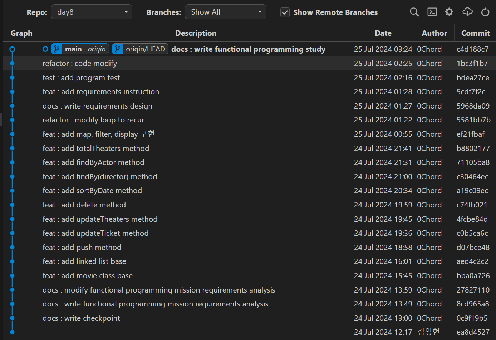

# 한 주간 누가 어떤 퀘스트를 수행 할지 정합니다.

```
저희는 첫 relaynote를 작성한 분 먼저 하나 선택 후 사다리타기로 결정하였습니다..!
```

- J016\_구영민 - 본인의 개발 관련 지식 중 평소에 ‘알고 있다고 생각하는 것’을 하나 고르고, 1~2줄 분량으로 짧게 설명을 기록해 봅니다.
- K031\_신민준 - 매일 하루를 보내며 느낀 점 짧게 적어보기
- J232\_정한힘 - 하루에 한번 피어 컴파일링 때, 짝 코드를 확인할 때, 코드의 커밋 로그 꼭 확인하기!
- J286\_황용진 - 하루에 1개 대상을 정하고 사용 안 하기
- J058\_김정욱 - 본인이 왜 개발자가 된건지 생각해보기
- S033\_손승재 - 오늘 달성 가능한 소소한 목표 세우고 실천 계획, 실천, 평가하기

# 수행결과

- S033\_손승재 -
  오늘 달성 가능한 소소한 목표 세우고 실천 계획, 실천, 평가하기
  - 목표설정
    - 새로 알게된 내용을 나만 이해할 수 있도록 정리했었는데 블로그에 남들도 이해할 수 있는 글 작성하기
  - 실천계획
    - 매일 미션을 해결하고나서 작성하기
  - 실천
    - 월,화,수는 성공했는 데 목요일은 미션해결 하고 시간이 넉넉하지않아서 정리를 못함
  - 평가
    - 제대로 정리가 안된거 같아 아쉬움, 주말에 다시 수정하고 업로드 해야지 !

- J232\_정한힘 -하루에 한번 피어 컴파일링 때, 짝 코드를 확인할 때, 코드의 커밋 로그 꼭 확인하기!  
  - git graph를 이용해서 로그를 확인했습니다.
  - 동료의 코드를 gist에 올라온 문서만 보는 게 아닌, 커밋 로그까지 확인하니 학습에 많은 도움이 됐습니다.
  - <details>
    <summary>커밋 로그 확인 사진들</summary>

     

     

     
    
    

  </details>

 - K031\_신민준 - 매일 하루를 보내며 느낀 점 짧게 적어보기
  - 실천 계획
    - 매일 미션을 끝낸 뒤 그날의 감상을 한줄평 적기
  - 실천
```
7/19
월요일부터 어제까지 힘들었는데 쉬어가는 날이여서 좋았고 수료생분들의 이야기를 듣고 의지를 다잡을 수 있었다
7/20
챌린지 시작하고 오랜만에 푹 쉬어서 좋았다.
7/21
1주차에서 어려웠던 것들을 되짚어봤는데 여전히 어렵고 다음주부터 열심히 해야겠다.
7/22
지난주에 다짐했던 학습-설계-구현의 과정으로 하니 오히려 시간이 덜 소모되는 것 같다.
7/23
피어세션 분들이 다 너무 잘하셔서 많은 팁들을 얻을 수 있었다.
7/24
지난주에는 구현도 다 못한 날이 많았는데 이번주는 오늘까지 전부 구현해서 성장한 것 같다.
7/25
진짜 너무 어렵다. 아직도 이해를 못 했다, 주말에 더 공부해야할 것 같다.
```

- 황용진
> **7/22(월) - console.log 안쓰기**
> 


process.stdout.write를 사용하여 출력

> **7/23(화) - Jest 안쓰기**
> 


mocha 프레임워크를 사용하여 테스트 진행

> **7/24(수) - 반복문 안쓰기**
> 


반복으로 동작을 수행해야 하는 경우 반복문 대신 재귀함수를 활용

> **7/25(목) - 마우스 안쓰기**
> 


노트북의 터치패드 사용
